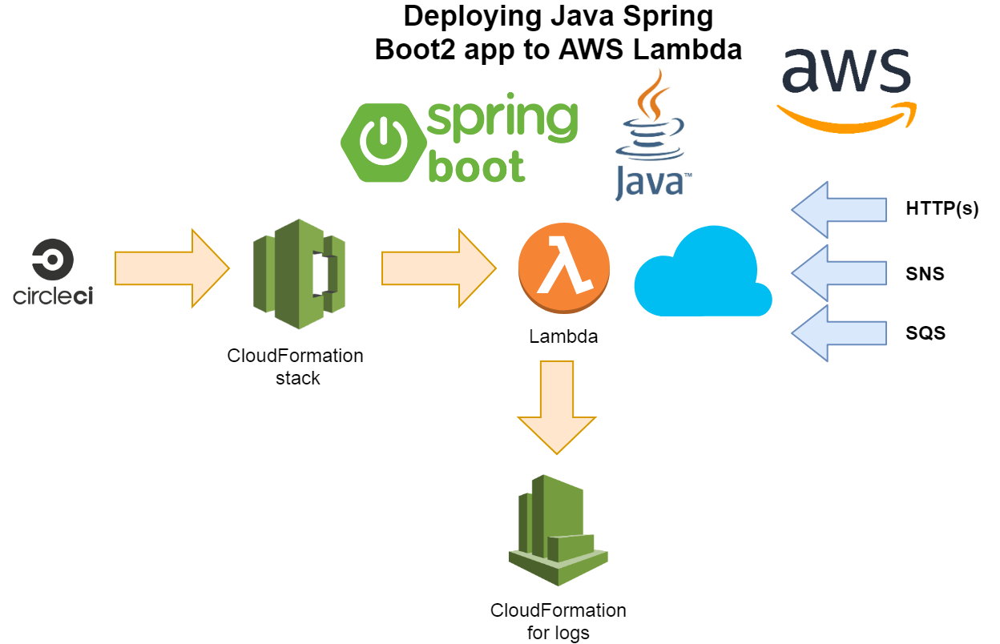

# Java Spring Boot Serverless application



Using [AWS Proxy wrappers](https://github.com/awslabs/aws-serverless-java-container/wiki/Quick-start---Spring-Boot) and  [`aws-serverless-java-container`](https://github.com/awslabs/aws-serverless-java-container) this application shows how you can easily build Java application and deploy it into AWS Lambda.

Also this application able to handle following AWS Events
 
  * CloudWatch scheduled event
  * SNS Topic message
  * SQS queue message
  
  
This project uses Java8, AWS CLI, AWS SAM CLI and Gradle to build, test and deploy code.
Aslo consult [CircleCI](.circleci/config.yml) for instructions how to setup automated CI/CD build and deployment for this.

## Running locally

To run function locally use `.\sam-local`

Try API endpoint in terminal or browser

```
curl -s http://127.0.0.1:3000/ping | json_pp
```

## Running in AWS

Deploy to AWS using
```bash
./deploy-to-aws
```

Open URL provided in output, for example: https://deadbeef.execute-api.eu-west-1.amazonaws.com/dev/ping

```bash
curl -s https://deadbeef.execute-api.eu-west-1.amazonaws.com/dev/ping | json_pp
{
   "pong" : "Hello, World!"
}
```

Bench time to run, notice that the first run with the same or more concurrent number of requests takes 6 seconds (i.e. Spring boot launch time)
```bash
ab -n 100 -c 20 https://deadbeef.execute-api.eu-west-1.amazonaws.com/dev/ping
```

## Requirements for deploying

To successfully deploy to AWS you need to define following environment variables:

  * AWS_ACCESS_KEY_ID	- AWS access key to use (IAM)
  * AWS_SECRET_ACCESS_KEY	- AWS access key password to use (IAM)
  * AWS_DEFAULT_REGION - AWS Region to use, for example eu-west-1	
  * S3_BUCKET	- Existing S3 bucket to use for deploying artifacts	
  * SNS_TOPIC	- Full ARN for SNS topic to subscribe to	
  * SQS_QUEUE - Full ARN for SQ queue to subcribe to

## Links

  * https://github.com/awslabs/aws-serverless-java-container/
  * https://docs.aws.amazon.com/lambda/latest/dg/configuration-layers.html
  * https://github.com/aws/aws-lambda-java-libs/tree/master/aws-lambda-java-events
